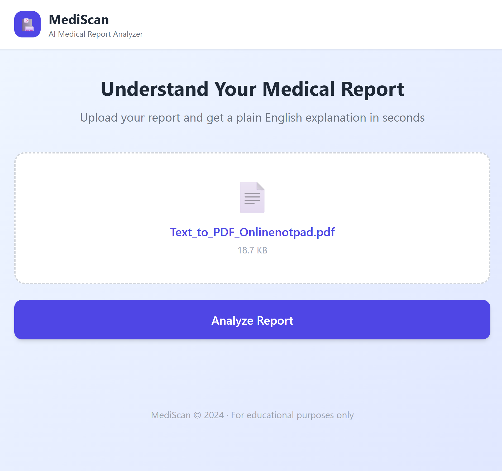
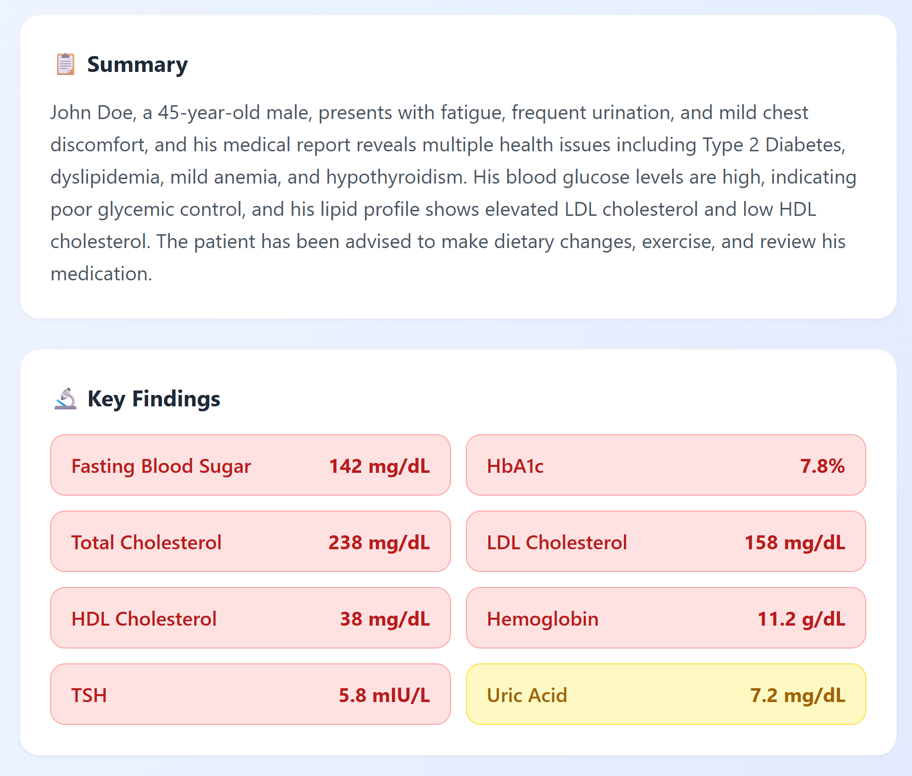

# 🏥 MediScan — AI Medical Report Analyzer

> Upload your medical report and understand it in plain English — instantly.

MediScan is an AI-powered web app that analyzes medical PDF reports and explains them in simple language. It highlights abnormal values, summarizes key findings, and provides actionable recommendations — making healthcare more accessible for everyone.


---

## 📸 Screenshots

| Upload Screen | Analysis Results |
|---|---|
|  |  |

!(./screenshots/report02.png)


## ✨ Features

- 📄 **PDF Upload** — Drag & drop or click to upload any medical report
- 🤖 **AI-Powered Analysis** — Uses Groq's Llama 3.3 for fast, accurate analysis
- 🔬 **Key Findings** — Extracts and displays all test values in a clean UI
- 🚨 **Abnormal Detection** — Color-coded flags for abnormal and borderline values
- ✅ **Recommendations** — Actionable next steps based on the report
- 📱 **Fully Responsive** — Works seamlessly on mobile and desktop

---

## 🛠️ Tech Stack

| Technology | Purpose |
|---|---|
| React + Vite | Frontend framework |
| Tailwind CSS | UI styling |
| PDF.js | PDF text extraction |
| Groq API (Llama 3.3) | AI report analysis |
| Vercel | Deployment |

---

## 🚀 Getting Started

### Prerequisites
- Node.js v18+
- Free Groq API key → [console.groq.com](https://console.groq.com)

### Installation

```bash
# Clone the repository
git clone https://github.com/yanshika-singh-dev/MediScan.git
cd MediScan

# Install dependencies
npm install

# Create environment file
cp .env.example .env
# Add your Groq API key to .env

# Start development server
npm run dev
```

### Build for Production

```bash
npm run build
```

---

## ⚙️ How It Works
User uploads PDF
↓
PDF.js extracts text from the report
↓
Text is sent to Groq's Llama 3.3 AI
↓
AI returns structured JSON analysis
↓
Results displayed with color-coded findings

---

## 📁 Project Structure
mediscan/
├── src/
│   ├── App.jsx          # Main application component
│   ├── App.css          # Component styles
│   ├── index.css        # Global Tailwind styles
│   └── main.jsx         # App entry point
├── public/              # Static assets
├── .env.example         # Environment variable template
├── .gitignore
├── tailwind.config.js
├── vite.config.js
└── README.md

---

## 🎨 Color Code System

| Color | Meaning |
|---|---|
| 🟢 Green | Normal value |
| 🟡 Yellow | Borderline value |
| 🔴 Red | Abnormal value — needs attention |

---

## 🔗 Part of My Healthcare AI Series

MediScan is part of a series of AI-powered healthcare tools I'm building:

| Project | Description | Link |
|---|---|---|
| 🏥 MediScan | Medical report analyzer | You are here |
| 🩺 ELCare | AI disease predictor | [Live](https://elcare-project.onrender.com) |
| ♿ AccessAI | AI accessibility platform | [Live](https://access-ai-five.vercel.app) |
| 📄 ResumeMatch | Resume job matcher | [Live](https://resume-match-eight.vercel.app) |

---

## ⚠️ Disclaimer

MediScan is for **educational and informational purposes only**. It is not a substitute for professional medical advice, diagnosis, or treatment. Always consult a qualified healthcare provider for medical decisions.

---

## 👩‍💻 Author

**Yanshika Singh**
- GitHub: [@yanshika-singh-dev](https://github.com/yanshika-singh-dev)
- LinkedIn: [linkedin.com/in/yourlinkedin](https://linkedin.com/in/yourlinkedin)

---

⭐ Found this useful? Give it a star — it helps a lot!